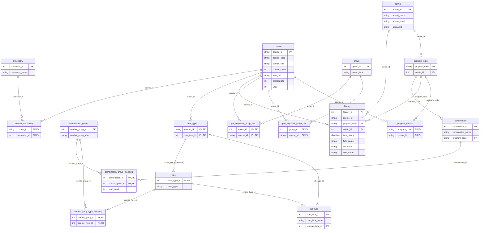
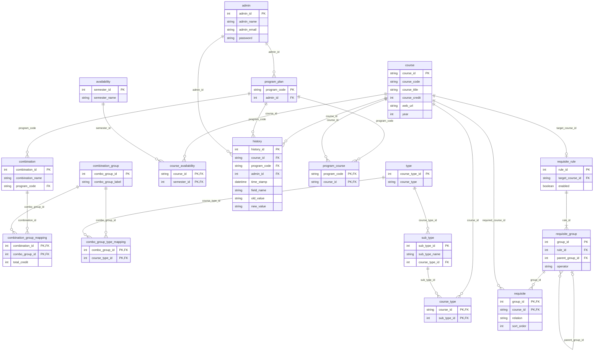

# ER Diagram

The below highlights the ER diagram for the current system (created via [mermaideidtor](https://mermaideditor.com/tools/sql-to-mermaid-erd)):

# Co-requisites update

The below diagram incorporates a potential update to the requisite logic. This 
includes a centralised rule table, with groups and course requisites:

