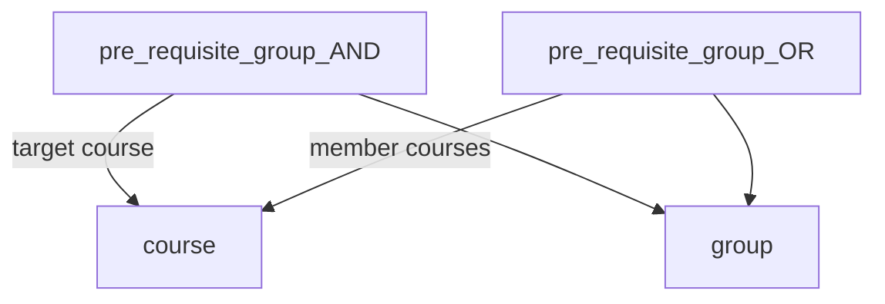
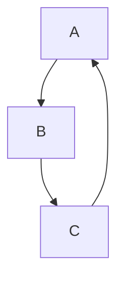

# Co-requisite requirements

This document details the current pre-requisite implementation in the 
StudyPlanner app and provides recommendations for incorporating co-requisites 
into the application.

## Current implementation

Currently, all courses are inserted into the backend database as a hardcoded 
relational tables set up via the `cs.sql` file. The relational structure aims to
allow logical rules to be encoded, setting up requirements that may be more 
complex than completing a single course requirement (e.g. complete intro to 
programming OR programming bootcamp 1 AND  programming bootcamp 2).

The following diagram outlines the relational structure currently implemented:

'*groups*' are created to allow chaining various logical statements. For
example, the 'Computing Theory' course has the pre-requisites of algorithms 
and analysis ***AND*** mathematics for computing 1. We can see this encoded
in the `pre_requisite_group_AND` table (004108 == computing theory):

|group_id|course ID|
|--------|---------|
|    117 |  004108 |
|    118 |  004108 |

Two groups are defined for the purposes of this subject as per the `group` 
table:

| group_id |    group_type|
|----------|--------------|
|      117 | prerequisite |
|      118 | prerequisite |

Going further, we see the `pre_requisite_group_OR` table has both `group_ids` 
with the two enforced pre-requisites present.

|group_id|course ID|
|--------|---------|
|    117 |   004302| # Algorithms and analysis
|    118 |   054076| # Mathematics for Computing 1

For reference, see the below `course` table extract.

|Code    | Title                                        |
|--------|----------------------------------------------|
| 004108 | Computing theory                             |
| 004302 | Algorithms and analysis                      |
| 054076 | Mathematics for Computing 1                  |

This system provides some flexibility for chaining logic, but is essentially 
limited to a series of `(A OR B) AND (C OR D OR ...) AND ...`.

There is also a more nebulous issue hiding with the current database design: 
group as a table name. SQL already has `group` as a reserved keyword for 
`GROUP BY` statements. This is a recipe for battling syntax errors over time.

## Co-requisite rules

Co-requisites act as a sort of superset of pre-requisites. Traditional 
pre-requisites allow for a course to be undertaken if and only if a course (or 
series of courses) has been completed prior. A co-requisite can also have this 
behaviour. If a course has a co-requisite requirement, if you have already 
completed that co-requisite, you satisfy the course requirement.

That being said, co-requisites add an additional layer of complexity in that it
can be undertaken simulatenously to the course it is a co-requisite for.

## Business rules

The business rules for co-requisites are simply slightly amended versions of
those for pre-requisites:

- a course with a co-requisite cannot be selected if the co-requisite is not 
  also selected
- a co-requisite course can be selected for any semester before the course it
  is a requisite for.
- a co-requisite course can also be selected for the SAME semester the course 
  it is a requisite for.
- removing a co-requisite should either remove or disable the course it is a
  co-requisite for.
- attempts to bypass the above rules should provide a clear warning message
  indicating why the action is not allowed

## Edge Cases

The logic of co-requisites is simple enough to entail few edge cases worth 
being aware of. The most critical edge-cases to avoid are those which create
situations where a student logically cannot take a course, due to some kind of
circular requisite chain.

For example, say course A is a co-requisite of course B. Course B is a 
pre-requisite for course C. What if course C is added as a pre-requisite for
course A?

This is only an issue if a cycle contains at least one pre-requisite. A cycle
of co-requisites is fine.

# Recommendations

1. **Extract out the seed data from the cs.sql file**. Presently, the backend 
  tables are created by a series of INSERT INTO statements. Aside from being 
  potentially brittle, this also leads to issues of maintainability. For example, 
  after formatting the file, there are over **15,000** lines of SQL. 
  There should be a separation of concerns, particularly for defining table
  schemas and populating them with data. It is recommended that the data be stored
  in a JSON or other data file while the schemas. Table schemas are already 
  defined in the `middlelayer/src/database/models/` directory.
2. **Reconsider the database layout**. There are multiple layers of indirection 
  for encoding business rules. Further, the `group` table name is poor practice.
  Ultimately, a more flexible rule system is desirable for adapting to changing.
  Instead of having tables represent requisite logic, we can define columns that
  entail the underlying logic. 

  Instead, it is proposed that a rule-based table (or tables) is established. 
  Given the graph/tree-like nature of course requisites, defining the table as
  a series of nodes allows rules to be checked by traversing them to find any
  cycles. Each node can be defined by it's logical type (e.g. AND, OR). This 
  allows the system's logic to be updated in future (e.g. a minimum number of
  course credit points).

  To enable a more intuitive system, it would be ideal to develop a minimal 
  admin UI where requisites can be edited, and where things like cycles can be 
  detected.
